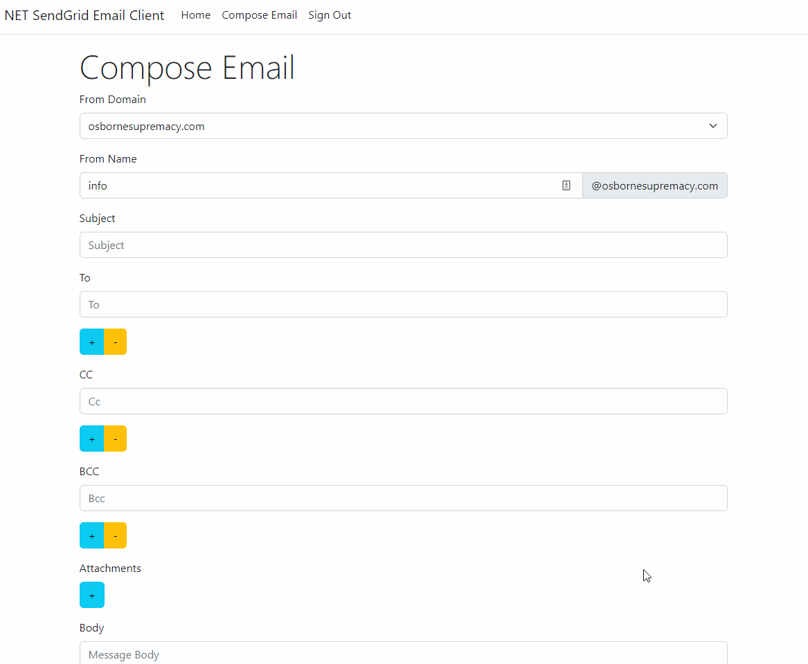
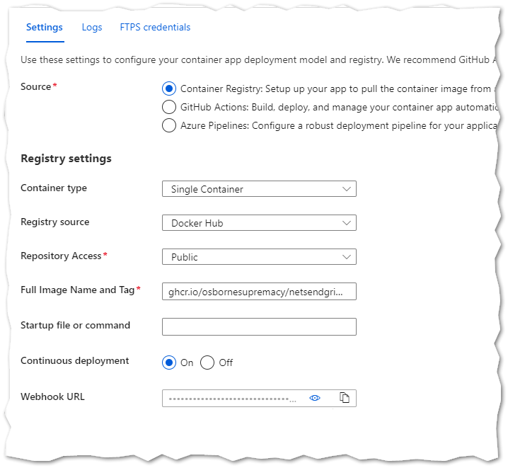

# net-sendgrid-email-client

Tool for sending emails via any address from a domain you control using SendGrid's API.

## The Problem

You may have a registered domain, want to use multiple email addresses associated with that domain, and have them all forward to one address.

You can set up a catch-all address with your domain registrar, which takes care of the receiving aspect.

But in my experience, there's not a simple way to send with any address on your domain.

## The Solution

When your domain is authenticated with SendGrid, you can send emails with any address on your domain using SendGrid's email API.

[app.sendgrid.com](https://app.sendgrid.com/) does not have a UI, however. So we need one.

This application is a simple .NET MVC web app that serves this purpose.

### Markdown Support

Once nice thing about this app that has nothing to do with the reason it was created, is that it supports Markdown for composing the email message body. Obviously the email editor isn't going to be as slick as Gmail, however for people who prefer Markdown for editing, it's a nice feature that took about no effort to add, thanks to [Markdig](https://github.com/xoofx/markdig).

## Authentication

If you only care about being able to do this from your local machine, you could just pull down the source and run the app locally in Visual Studio.

However, I wanted to be able to send emails from any device. For this we can deploy to an Azure app service. There's a free tier (with quotas) that meets my needs.

But, of course, I only want authorized users (namely me) to be able to send emails using my email domain.

Authentication is hard, so I'm using [Google Open ID Connect](https://developers.google.com/identity/protocols/oauth2/openid-connect) to authenticate.

Use that document as a guide. I'm not going to reproduce the steps in this readme, but I'll highlight some things.

### Google Cloud Configuration

You will need to create an OAuth client ID in Google Cloud, and add the client ID and secret to the app configuration.

You will also need to configure an OAuth consent screen.

#### Managing Existing API Credentials

1. Go to [Service Management API](https://console.cloud.google.com/apis/api/servicemanagement.googleapis.com)
2. Click the name of your project under (OAuth 2.0 Client IDs)

## Authorization

You may be tempted to use Google Cloud for authorization, leaving the app with a publishing status of "Testing" and whitelisting your users there. That doesn't work (unless Google fixes it in the future). Google currently does not limit access to the whitelisted test users.

Instead, use .NET's policy/claims-based auth. Only users with email addresses whitelisted in the admins section of the app configuration will be able to access the email functionality.

## SendGrid Configuration

1. Go to [sendgrid.com](https://sendgrid.com/), registering for an account if you don't already have one.
2. Go to Settings --> Sender Authentication.
3. Activate / Verify both *Domain Authentication* and *Link Branding*. Both involve adding DNS records.
    * Tip if your registrar is Namecheap: the host values that SendGrid tells you to add include your domain name. Don't copy that part of the value into Namecheap. e.g.:
        * SendGrid's host value: `em1234.yourdomain.com`
        * The value you should copy to Namecheap: `em1234`
4. Go to API Keys --> Create API Keys --> Restricted Access.
    * The only access it needs is full access to `Mail Send`.
5. Name your key and copy the value.

## .NET Configuration

When running the application locally, you can provide all the values stubbed out in [appsettings.json](/src/NetSendGridEmailClient.Web/appsettings.json).

### Azure Configuration

If you're using the application in Azure, add the settings as key/value pairs in the application configuration (App Service --> Configuration --> Application settings). Since the naming convention for those settings can be a little tricky, I've included an example in this repository.

[SampleAzureConfiguration.json](SampleAzureConfiguration.json)

#### Azure App Service

You can use an Azure App Service with your configuration settings (above), and this app's image from GitHub Container Registery. Your deployment center settings should look like this:

